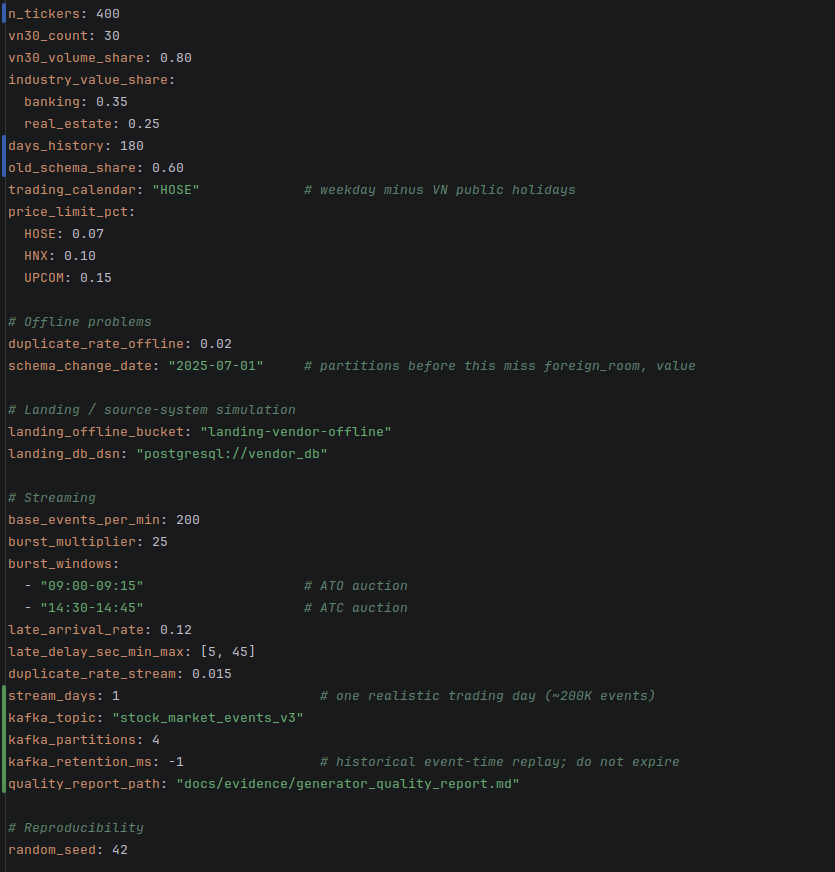
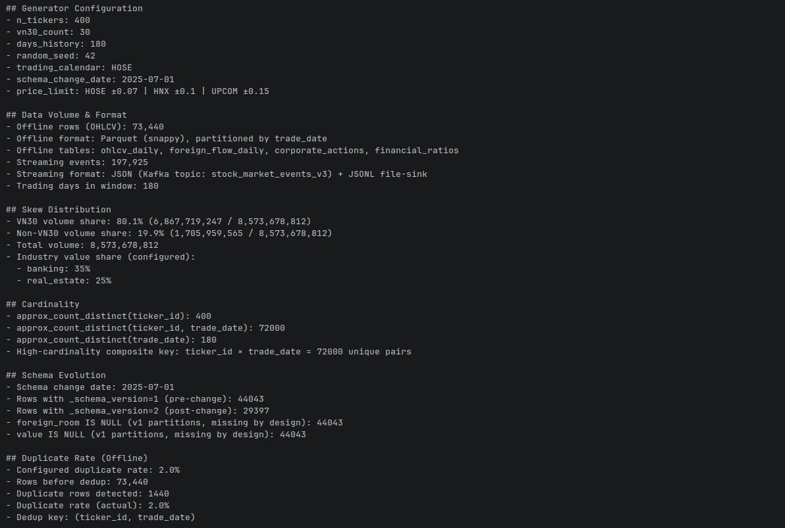
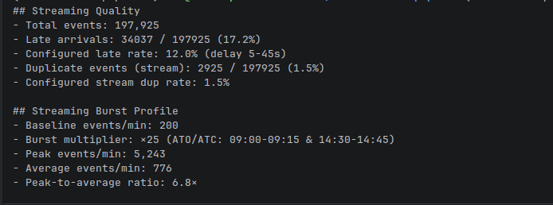
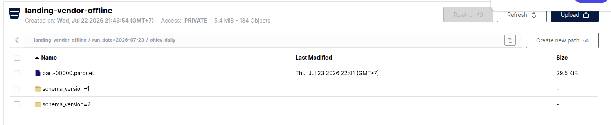
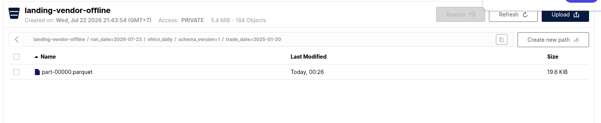

# Data Generator

This document covers the generator rubric: offline skew, cardinality, physical
schema evolution, duplicates, streaming burst/late/duplicate behavior,
configuration, and persistence at the vendor boundary. The figures below are
from the seed-42 reference run; the machine-readable source is
[`evidence/generator_quality_report.md`](evidence/generator_quality_report.md).

## 1. Domain Overview

This project simulates the **Vietnamese stock market** (HOSE-centric, with HNX/UPCOM tickers for variety). The generator produces:

- **Offline historical/reference data** (Parquet): daily OHLCV, foreign flows, corporate actions, financial ratios.
- **Streaming real-time events** (JSON via Kafka + JSONL file-sink): intraday trades, quotes, and index updates.

**Generation strategy (hybrid "real seed, synthetic data"):** real reference data (ticker list, ICB industry classification, realistic price distribution ranges) is collected **once** from the public `vnstock` library and frozen as a static seed file (`generator/seed/tickers_reference.json`). All historical and streaming records are then **synthetically generated** from these distributions. This keeps the domain realistic while giving full control over injected data problems (duplicate rate, late arrivals, schema evolution, drift) — which real API data cannot provide.

The goal is to support downstream ingestion, transformation, and feature engineering while intentionally injecting realistic data quality and processing challenges.

## 2. Design

### 2.1 Ticker Selection

- The submitted configuration selects 400 tickers from the frozen seed file
- First `vn30_count` tickers tagged as VN30 (large-cap index)
- Each ticker carries: `ticker_id`, `ticker`, `company_name`, `exchange` (HOSE/HNX/UPCOM), `icb_l1`, `icb_l2`, `listing_date`, `is_active`
- Implemented in `generator/generators.py:Generator._select_tickers()`

### 2.2 Price Generation Model

Daily close prices follow a **geometric random walk per ticker**:

```
close(t) = close(t-1) × exp(μ + σ × z)
```

where `μ` (drift) and `σ` (volatility) are sampled per ticker from industry-level baselines:

| Industry | μ | σ | Rationale |
|----------|---|---|-----------|
| Financials (Banking) | -0.0001 | 0.012 | Stable, low volatility |
| Real Estate | 0.0000 | 0.022 | High volatility, speculative |
| Others | 0.0002 | 0.016 | Moderate |

Initial close prices are sampled from exchange-appropriate ranges (HOSE: 8K–150K VND, HNX: 6K–80K VND, UPCOM: 3K–50K VND). Open/high/low are derived from close with bounded intraday ranges. Prices respect the **±7% HOSE daily limit** (±10% HNX, ±15% UPCOM).

Volume is sampled from a log-normal distribution with VN30 tickers given much higher means (500K baseline vs 50K for non-VN30).

Implemented in `generator/generators.py:Generator.generate_ohlcv()`.

### 2.3 Trading Calendar Handling

Unlike the e-commerce domain, data only exists on **trading days**. The generator embeds a HOSE trading calendar via `generator/calendar.py`:

- Monday–Friday, excluding Vietnamese public holidays (Tết Nguyên Đán, Hùng Kings, 30/4–1/5, 2/9)
- Non-trading days produce **no rows** — downstream pipelines must handle calendar gaps as a first-class concept (this is a deliberate design challenge: "missing date" is *not* a data quality error here)
- `is_trading_day(d)` and `generate_trading_calendar(start, n_days)` exported for use by both generator and downstream validation

### 2.4 Offline Tables

| Table | Grain | Key Columns | Generator Method |
|-------|-------|------------|------------------|
| `ohlcv_daily` | one per ticker per trading day | ticker_id, trade_date, open, high, low, close, volume, value, foreign_room | `generate_ohlcv()` |
| `foreign_flow_daily` | one per ticker per trading day | ticker_id, trade_date, foreign_buy/sell_vol, foreign_buy/sell_value | `generate_foreign_flow()` |
| `corporate_actions` | one per action | action_id, ticker_id, action_type (cash_dividend/stock_dividend/split), ex_date, ratio | `generate_corporate_actions()` |
| `financial_ratios` | one per ticker per quarter | ticker_id, report_quarter, eps, pe, pb, roe | `generate_financial_ratios()` |

### 2.5 Streaming Event Schema

Single unified Kafka topic `stock_market_events_v3` with an `event_type`
discriminator. The generator creates it with four ticker-keyed partitions and
`retention.ms=-1`, which preserves the historical event-time replay:

| Field | Type | Description |
|-------|------|-------------|
| `event_id` | UUID | Unique event identifier |
| `event_type` | enum | `trade` (85%), `quote` (12%), `index_update` (3%) |
| `event_timestamp` | ISO-8601 | Exchange matching time |
| `created_ts` | ISO-8601 | Row creation/arrival time (may differ for late events) |
| `session_type` | enum | `ATO`, `continuous`, `ATC` |
| `ticker` | string | Nullable for `index_update` events |
| `exchange` | string | HOSE/HNX/UPCOM |
| trade fields | — | `price`, `quantity`, `side` (buy/sell), `trade_id` |
| quote fields | — | `bid_price`, `bid_qty`, `ask_price`, `ask_qty` |
| index fields | — | `index_name` (VNINDEX/VN30), `index_value`, `index_change_pct` |

### 2.6 Intraday Session Model

Events are only generated inside HOSE trading hours:

| Session | Time | Burst Multiplier | Description |
|---------|------|-----------------|-------------|
| ATO auction | 09:00–09:15 | ×25 | Opening auction — order matching concentrates at open |
| Continuous | 09:15–11:30 | ×1 | Regular trading, morning session |
| Lunch break | 11:30–13:00 | 0 | Zero events — downstream watermark must tolerate silence |
| Continuous | 13:00–14:30 | ×1 | Regular trading, afternoon session |
| ATC auction | 14:30–14:45 | ×25 | Closing auction — order matching concentrates at close |

The lunch-break silence window (11:30–13:00) is a natural "session gap" that downstream watermark/window logic must handle without false alerts.

Implemented in `generator/generators.py:Generator.generate_streaming_events()`.

## 3. Configuration

See `config/generator.yaml` for all parameters. The submitted reference
configuration is:

```yaml
# Universe
n_tickers: 400
vn30_count: 30
vn30_volume_share: 0.80     # skew control
industry_value_share:
  banking: 0.35
  real_estate: 0.25
days_history: 180
old_schema_share: 0.60
trading_calendar: "HOSE"
price_limit_pct: {HOSE: 0.07, HNX: 0.10, UPCOM: 0.15}

# Offline problems
duplicate_rate_offline: 0.02
schema_change_date: "2025-07-01"

# Streaming
base_events_per_min: 200
burst_multiplier: 25
burst_windows: ["09:00-09:15", "14:30-14:45"]
late_arrival_rate: 0.12
late_delay_sec_min_max: [5, 45]
duplicate_rate_stream: 0.015
stream_days: 1
kafka_topic: "stock_market_events_v3"
kafka_partitions: 4
kafka_retention_ms: -1

# Reproducibility
random_seed: 42
```

Drift config in `config/drift.yaml` (see Section 5).



*Figure 1 — The actual YAML used for the evidence run: 400 tickers, 180
trading days, v1/v2 boundary, 2% offline duplicates, 12% configured late
probability, 1.5% stream duplicates, ×25 auction bursts, four Kafka
partitions, and seed 42.*

## 4. Data Problems Injected

### 4.1 Offline Problems

| Problem | Parameter | Config Value | Verification Method | Why Chosen |
|---------|-----------|-------------|---------------------|------------|
| **Skew** | `vn30_volume_share`, `industry_value_share` | 80% VN30, 60% banking+real estate | Volume share by VN30 vs rest, value share by industry | Matches real HOSE microstructure — VN30 dominates liquidity |
| **Schema evolution** | `schema_change_date` | 2025-07-01 (v1→v2) | Column presence + null counts per partition | Simulates vendor API upgrade — old partitions physically lack `foreign_room`, `value` columns |
| **Duplicate rate** | `duplicate_rate_offline` | 2% | Row count before/after dedup on (ticker_id, trade_date) | Simulates API retry returning identical payload |
| **High cardinality** | `n_tickers × days_history` | ~400 × 180 = 72K keys | `approx_count_distinct` on key columns | Natural consequence of ticker × date grain |

Implementation:
- Skew: `generator/problems.py:apply_volume_skew()` — redistributes total volume: VN30 gets 80%, non-VN30 gets 20%
- Schema versioning: `generator/problems.py:tag_schema_version()` — stamps `_schema_version=1` before `schema_change_date`, `=2` after
- Duplicates: `generator/problems.py:inject_duplicates()` — duplicates `rate` fraction of rows, identical across all columns
- `value` and `foreign_room` columns are only populated for rows where `trade_date >= schema_change_date` in `generator/generators.py:generate_ohlcv()`



*Figure 2 — Seed-42 offline quality output. It shows 73,440 input rows,
72,000 distinct ticker/date keys, VN30 volume share 80.1%, 44,043 v1 rows
with structurally missing `foreign_room` and `value`, and 1,440 injected
duplicates (2.0%).*

### 4.2 Streaming Problems

| Problem | Parameter | Config Value | Verification Method | Why Chosen |
|---------|-----------|-------------|---------------------|------------|
| **Burst** | `burst_multiplier`, `burst_windows` | ×25 at ATO (09:00-09:15) and ATC (14:30-14:45) | Events/min timeline | Mirrors real HOSE auction microstructure — order matching concentrates at open/close |
| **Late arrivals** | `late_arrival_rate`, `late_delay_sec_min_max` | 12%, 5–45s | Late event rate by window | Market data feed congestion during bursts — late probability correlated with burst windows |
| **Duplicate rate** | `duplicate_rate_stream` | 1.5% | Event count before/after dedup on event_id | At-least-once delivery from feed handler |

Implementation:
- Burst: multiplier applied to `base_events_per_min` during burst windows in `generate_streaming_events()`
- Late arrivals: `created_ts = event_timestamp + random(5, 45) seconds` for 12% of events
- Stream duplicates: `inject_stream_duplicates()` — exact copies of randomly selected events, shuffled back into the stream



*Figure 3 — Streaming quality output: 197,925 emitted records, 2,925 replayed
event IDs (1.5%), 200 events/min baseline, ×25 ATO/ATC burst configuration,
and a measured peak of 5,243 events/min. The configured base late probability
is 12%; the measured 17.2% is higher because the implementation multiplies
late probability during auction bursts and the report includes replays.*

### 4.3 Cross-Consistency Guarantee

The generator ensures intraday trades are **consistent with the daily OHLC** for the same ticker on the same day:
- Intraday prices stay within [low, high] of the daily bar
- The last ATC trade price ≈ daily close
- Sum of `fact_intraday_trade.quantity` per ticker per day ≈ `fact_daily_price.volume`

This cross-consistency is deliberately checkable downstream — a mismatch signals a pipeline bug, not a data problem.

## 5. Drift Simulation (from 03)

### 5.1 Scenario A: Volatility Regime Shift

Injects a gradual (or abrupt) increase in daily return volatility across the universe, simulating a market correction phase.

**What changes:**
- Daily return σ rises from ~1.2% to ~2.5% per day after `drift_start_date`
- Small-cap (non-VN30) tickers amplified ×1.3 relative to VN30
- In gradual mode (default), the multiplier ramps linearly over 10 trading days

**How it works in code:**

The drift ramp is computed in `generator/generators.py:_drift_ramp()`:

```
sigma_eff = sigma * (1 + (volatility_multiplier - 1) * ramp)
if not vn30: sigma_eff *= smallcap_amplifier
```

Where `ramp` transitions from 0.0 (pre-drift) to 1.0 (post-drift) over `ramp_trading_days` in gradual mode, or jumps immediately in abrupt mode.

**Features affected:**
- `f_ticker_volatility_20d` — increases with a built-in detection lag (the 20-day window only gradually absorbs post-drift days)
- `f_stream_price_momentum_30m` — distribution widens
- Secondary: return-based features (`f_ticker_return_5d`, `f_ticker_ma20_gap`) show wider dispersion

**Why Scenario A:** easiest to inject cleanly (one multiplier on sigma), clearly visible in PSI, and has an unambiguous ML consequence — a direction-prediction model trained on the calm regime degrades in the volatile regime, providing a genuine retrain trigger for the ML pipeline (04).

### 5.2 Drift Configuration (`config/drift.yaml`)

```yaml
drift_enabled: true
drift_start_date: "2025-09-01"
drift_mode: "gradual"               # or "abrupt"
drift_ramp_trading_days: 10

scenario_A_volatility_regime: true
scenario_B_liquidity: false
scenario_C_foreign_reversal: false
scenario_D_sector_rotation: false

volatility_multiplier: 2.1          # sigma 1.2% -> ~2.5%
smallcap_amplifier: 1.3             # non-VN30 tickers drift harder
```

### 5.3 Drift Validation Report

Auto-generated at `data/gold/drift_validation_report.csv` by
`jobs/gold/drift.py:generate_drift_report()`:

```
date         | feature_name              | mean   | psi_vs_baseline | drift_status
2025-08-29   | f_ticker_volatility_20d   | 0.0121 | 0.00            | baseline
2025-09-10   | f_ticker_volatility_20d   | 0.0156 | 0.06            | detected
2025-09-22   | f_ticker_volatility_20d   | 0.0203 | 0.13            | strong
2025-10-02   | f_ticker_volatility_20d   | 0.0244 | 0.19            | alert
```

Note the detection lag relative to `drift_start_date` (2025-09-01): the 20-trading-day window dilutes the new regime until enough post-drift days enter the window. This is a monitoring design consideration — shorter windows detect faster but alarm noisier.

## 6. Landing Stage — Simulating External Source Systems

Before any pipeline touches the data, the generator writes to separate landing stores that stand in for external systems the pipeline does not control:

| Landing Store | Technology | Pattern | Content |
|---------------|-----------|---------|---------|
| `landing-vendor-offline/` | MinIO (Parquet) | End-of-day file drop | `ohlcv_daily`, `foreign_flow_daily`, `corporate_actions`, `financial_ratios` partitioned by `run_date` |
| `vendor_db` | PostgreSQL | Batch DB-extract (JDBC pull) | `tickers`, `corporate_actions` (reference tables) |
| `stock_market_events_v3` | Kafka topic | Real-time event stream | Trade, quote, index_update events |
| `events/yyyy-mm-dd/HH/` | JSONL file-sink | Vendor replay/audit log | Same events as Kafka, partitioned by date/hour |

This landing stage matters for grading: **Bronze ingestion must demonstrate pulling from an external boundary**, not just reading a folder the pipeline wrote itself. The Bronze job handles connection/credentials, partial drops, and "vendor schema" exactly as it would with a real third-party system.

Implemented in `generator/writers.py`: `write_parquet_landing()`, `write_to_postgres()`, `write_to_kafka()`, `write_jsonl()`.



*Figure 4 — MinIO bucket `landing-vendor-offline`, run date 2026-07-23,
showing both physical `schema_version=1` and `schema_version=2` directories
under `ohlcv_daily`. The quality report above proves which fields are absent
from v1; an object-browser folder view alone does not prove column absence.*



*Figure 5 — A v1 physical partition at
`schema_version=1/trade_date=2025-01-20` containing
`part-00000.parquet`. This proves that landing data is persisted outside the
Bronze tables with version/date partitioning.*

## 7. Quality Report

Auto-generated per run by `generator/writers.py:generate_quality_report()`,
with the configured output
`docs/evidence/generator_quality_report.md`:

- **Skew distribution** — VN30 volume share %, total volume
- **Cardinality** — unique `ticker_id`, unique `(ticker_id, trade_date)` groups
- **Schema evolution** — row counts per `_schema_version`, `foreign_room` null counts
- **Stream quality** — total events, late arrival count/rate, duplicate event count/rate
- All deterministic with `random_seed: 42` — every grading run reproduces identical data, including which rows are duplicated and which events arrive late

## 8. Output

| Type | Format | Location | Pattern |
|------|--------|----------|---------|
| Offline | Parquet (local staging and MinIO object copy) | `data/landing/run_date=YYYY-MM-DD/` and `landing-vendor-offline/run_date=YYYY-MM-DD/` | End-of-day file drop |
| Reference | PostgreSQL | `vendor_db` (tickers, corporate_actions) | Batch DB-extract |
| Streaming | JSON → Kafka + JSONL file-sink | `stock_market_events_v3` topic + `data/events/` | Real-time events + replay audit log |

## 9. CLI Usage

```bash
# Generate offline Parquet + PostgreSQL reference tables
python -m generator.main --mode offline --config config/generator.yaml

# Generate streaming events to Kafka + JSONL
python -m generator.main --mode stream --config config/generator.yaml

# Generate both (offline first, then stream — shares OHLCV for cross-consistency)
python -m generator.main --mode all --config config/generator.yaml
```

Drift config (`config/drift.yaml`) is auto-merged into the main config if present (see `generator/main.py:load_config()`).

## 10. Implementation Tips (from coursework 01 §7)

- **Deterministic seed** (`random_seed: 42`) so every run reproduces identical data.
- **Dedup keys:** (`ticker_id`, `trade_date`) for offline OHLCV; (`event_id`, latest `created_ts`) for streaming.
- Generate the daily close series **first**, then derive intraday trades consistent with that day's OHLC — this cross-consistency between batch and stream is checkable downstream.
- Keep corporate-actions generator simple (2–3 actions per month) but ensure at least one split occurs inside the simulated window, because adjusted-price logic depends on it.
- Treat `landing-vendor-offline/` and `vendor_db` as **read-only** from the pipeline's perspective once written — Bronze ingestion connects to them exactly as it would to a real third-party system.
