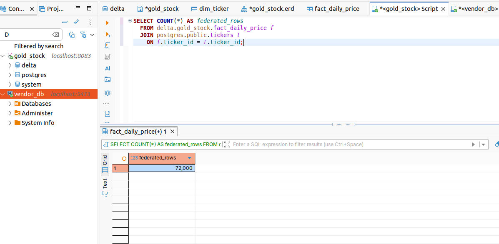

# Novel Ideas

> Ideas must go beyond EDAI curriculum (M1-M12).

---

## Idea 1: Trino Federated Query Engine — Cross-Source SQL Without Data Movement

**What:** Trino acts as a single SQL query interface across **Delta Lake on MinIO** (object storage) and **PostgreSQL** (relational database), enabling cross-source JOINs without ETL data movement. Trino catalog files are configured in `docker/trino/catalog/`:
- `delta.properties` — connects to Delta Lake tables stored on MinIO (S3-compatible)
- `postgres.properties` — connects to PostgreSQL `vendor_db` for reference data

**Why beyond EDAI:** M8 covers storage concepts (lakehouse, Delta, Trino at name level) and M11 mentions OLAP engines at concept level (`📖 mức khái niệm`) — but neither module covers actually deploying, configuring, and querying a federated query engine across heterogeneous sources. This implementation exercises: catalog configuration, cross-source query optimization, schema discovery from Delta + JDBC, and practical query patterns that differ from single-source Spark SQL.

**Implementation:**
- Trino container in `docker-compose.yml` (port 8083)
- Catalog files: `docker/trino/catalog/delta.properties` (MinIO-backed Delta) + `postgres.properties` (vendor_db)
- Query examples: `scripts/trino_examples.sql` demonstrates cross-source queries (e.g., JOIN Delta Gold tables with PostgreSQL ticker reference)
- Gold layer tables are exposed through Trino for DBeaver or another BI client
- Benefit: analysts query Gold data via SQL without needing Spark; Trino optimizes reads at the Delta file level (predicate pushdown, partition pruning)

**Measured proof:** the query joins
`delta.gold_stock.fact_daily_price` to `postgres.public.tickers` through the
same Trino connection and returns 72,000 rows.

*Figure 1 — DBeaver SQL and result for the cross-catalog join. The connection
tree shows the Trino `delta` and `postgres` catalogs, while the result
`federated_rows = 72,000` matches the Gold daily-fact grain. This proves
federation without copying PostgreSQL reference rows into the Delta fact
table. A separate `EXPLAIN`/skipped-splits screenshot was not captured, so
partition-pruning performance is not claimed as visual evidence.*

---

## Idea 2: Versioned Data Contracts with JSON Schema — Catch Unannounced Schema Changes Before They Corrupt Bronze

**What:** Key Bronze, Silver, Gold and feature datasets have versioned JSON
Schema contracts (`contracts/*.v1.json`, `.v2.json`) that define required
columns and types. The Bronze OHLCV job validates data against the contract
matching its `_schema_version` before writing to Delta. A populated column
absent from the selected contract is a **contract violation**, distinct from
the registered v1→v2 evolution.

**Why beyond EDAI:** M5 covers software testing (pytest, TDD) and M12 mentions "data validation fundamentals: circuit breaker, validation frameworks, data contracts" at concept level — but neither covers implementing a production-grade contract enforcement pattern. This idea demonstrates: JSON Schema as a lightweight alternative to Schema Registry (no Kafka dependency), versioned contract evolution, the distinction between "evolution" (planned) and "violation" (unplanned), and integration with the ingestion pipeline as a quality gate.

**Implementation:**
- Contract files: `contracts/raw_ohlcv_daily.v1.json` (7 required columns),
  `.v2.json` (9 required columns — adds `value`, `foreign_room`)
- `jobs/bronze/offline.py`: `validate_contract(df, contract, version)` raises `ValueError` on missing required columns
- `load_contract(version)` reads the correct contract file per `_schema_version`
- Generator stamps `_schema_version` per row based on `schema_change_date` — old partitions get v1, new partitions get v2
- Shared Spark configuration
  `spark.databricks.delta.schema.autoMerge.enabled=false` prevents silent
  automatic Delta schema merge
- `contracts/raw_market_events.v1.json`, `stg_trades.v1.json`, `stg_quotes.v1.json`, `feat_stream_intraday.v1.json` extend the pattern to the streaming path

**Proof available in the repository:**

1. `contracts/raw_ohlcv_daily.v1.json` requires seven v1 fields, while
   `raw_ohlcv_daily.v2.json` requires `value` and `foreign_room` in addition.
2. `jobs/bronze/offline.py:validate_contract()` rejects missing required
   fields and populated unregistered fields before Bronze is written.
3. DP1 Figure 1 in `orchestration_governance.md` shows the successful
   `validate_contract` gate in the Airflow graph.
4. Unit tests exercise contract loading/enforcement.

No Airflow task-log screenshot of a deliberate failing contract is present.
Therefore this idea has executable code and a successful pipeline gate, but
not the strongest requested pass/fail UI demonstration.
