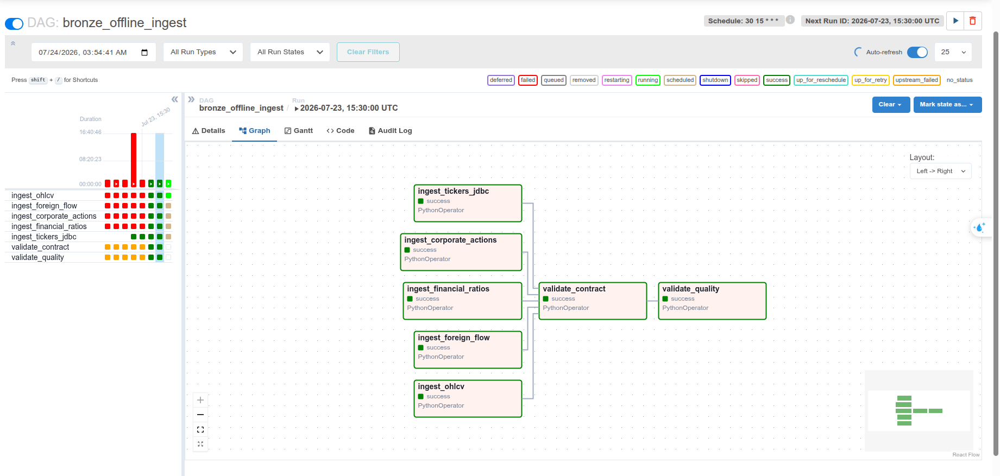
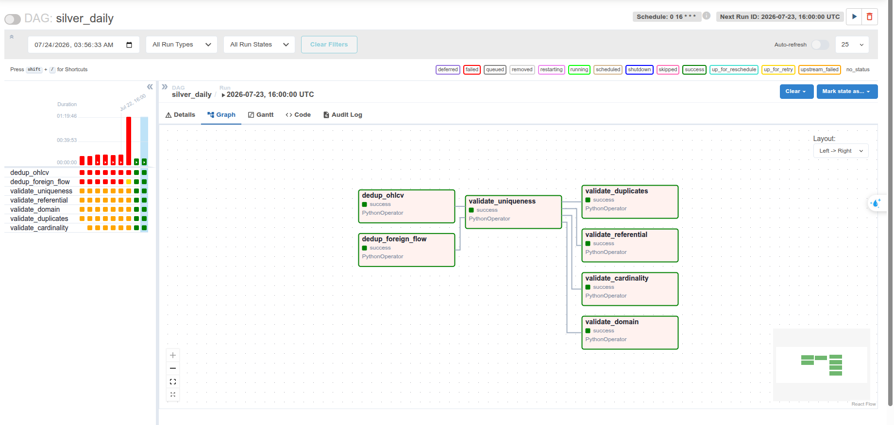
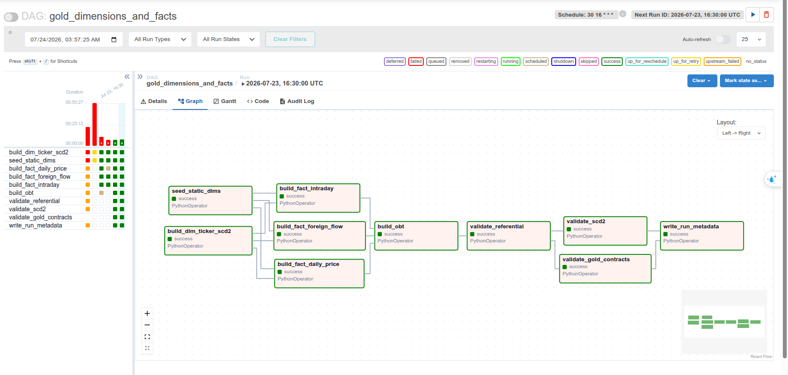
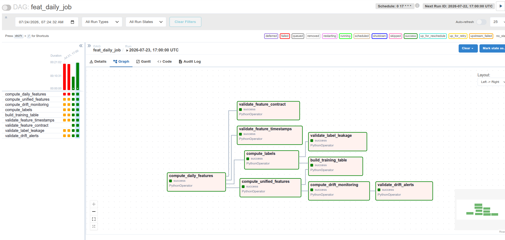

# Orchestration and governance

## Airflow pipelines

| Pipeline | Ingest/compute stage | Validation stage |
|---|---|---|
| DP1 `bronze_offline_ingest` | landing Parquet/reference sources → versioned Bronze Delta | contracts, row counts, keys and domains |
| DP2 `silver_daily` + `gold_dimensions_and_facts` | dedup/harmonize → dimensions, facts and OBT | cardinality, referential integrity, SCD2 and Gold contracts |
| DP3 `feat_daily_job` | daily/unified features, PSI, labels and training table | timestamps, feature contract, label distribution and drift alerts |

The captured runs below are the scheduled 2026-07-23 runs displayed by
Airflow. They are separate from the manual reference runs recorded in
`rubric_evidence.md`; captions use the timestamp visible in each image rather
than assigning an unsupported manual run ID.

### DP1 — Bronze ingestion



*Figure 1 — `bronze_offline_ingest`, scheduled run
2026-07-23 15:30 UTC. Five source tasks ingest OHLCV, foreign flow, corporate
actions, financial ratios and PostgreSQL tickers; all converge on
`validate_contract` and then `validate_quality`. Every displayed task is
green/success.*

### DP2 — Silver and Gold



*Figure 2 — `silver_daily`, scheduled run 2026-07-23 16:00 UTC. Both
deduplication branches feed `validate_uniqueness`, followed by referential,
domain, duplicate and cardinality gates. All seven tasks are successful.*



*Figure 3 — `gold_dimensions_and_facts`, scheduled run
2026-07-23 16:30 UTC. SCD2/static dimensions feed three fact builders, then
OBT, referential checks, SCD2/contract checks and run metadata. All displayed
tasks are successful.*

### DP3 — Features, labels and drift



*Figure 4 — `feat_daily_job`, scheduled run 2026-07-23 17:00 UTC. The graph
shows daily and unified features, labels, training-table construction, drift
monitoring, timestamp/contract/leakage checks and the drift-alert gate. All
nine tasks are successful.*

Shared locations and connection endpoints are environment variables in
`docker-compose.yml`; job code does not embed host-only endpoints. The Airflow
deployment currently uses environment-backed connections because the whole
coursework stack is local. For a shared environment, move the same values into
Airflow Connections/Variables or a secrets backend without changing job code.

Verify DAG parsing:

```bash
docker compose exec -T airflow-scheduler airflow dags list-import-errors
docker compose exec -T airflow-scheduler airflow dags list
```

## Data contracts

Contracts in `contracts/` cover DP1 raw data, DP2 Silver/Gold data and DP3
feature data. Planned OHLCV v1→v2 evolution is represented by two physical
Parquet schemas and two contract files. Unknown populated fields fail before
Bronze; Gold/feature DAGs validate `dim_ticker`, `fact_daily_price` and
`feat_ticker_daily`.

## Lineage manifest

`datahub/lineage.yml` is the source-of-truth mapping used to publish:

```text
DP1: landing-vendor-offline → raw_* → stg_*
DP2: stg_* → dim_*/fact_* → obt_*
DP3: fact_* → feat_* → ml_*
```

The manifest records upstream/downstream dataset edges. DataHub is
intentionally not part of the lightweight default Compose stack; run a local
DataHub quickstart, ingest the manifest with the documented command, and
capture each DP's lineage.

The current recipe publishes **dataset-level lineage only**. It does not
publish Airflow jobs, JSON contract objects, validation assertions or
contract/schema tabs as DataHub entities. No DataHub screenshots are present
in the submitted image set, so all six governance UI rubric items remain
without visual proof. An empty tab is not treated as completed evidence.
