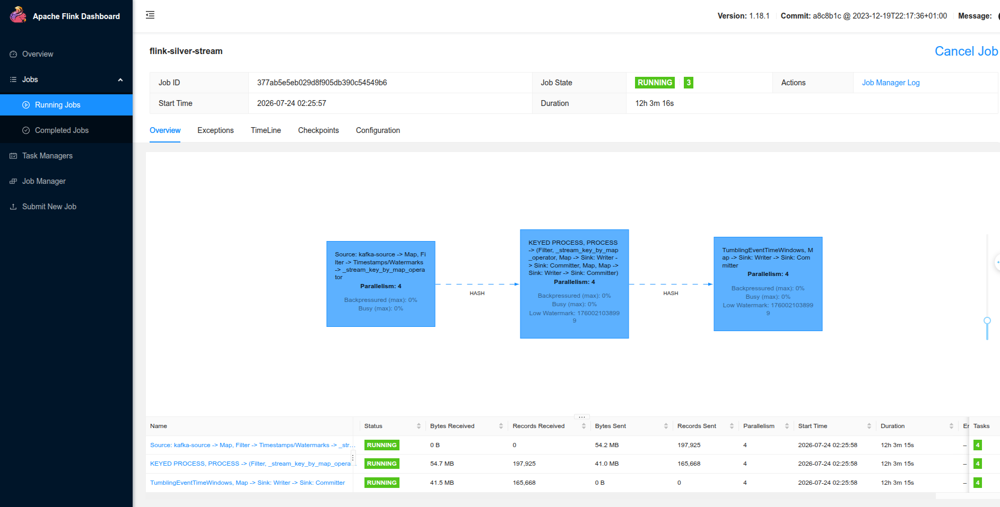
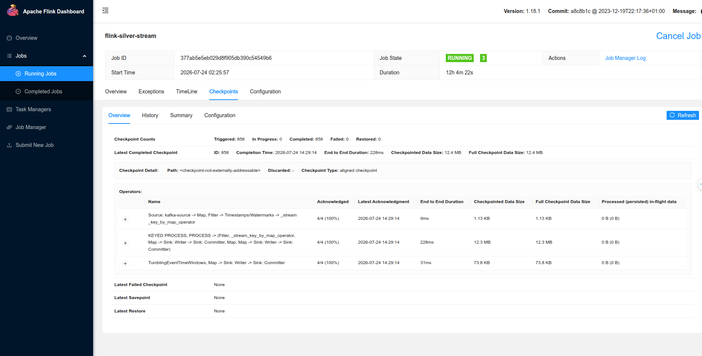
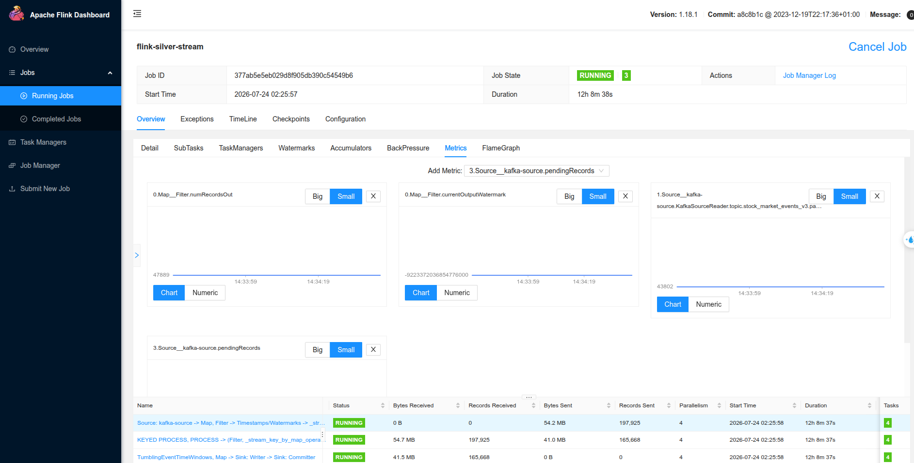
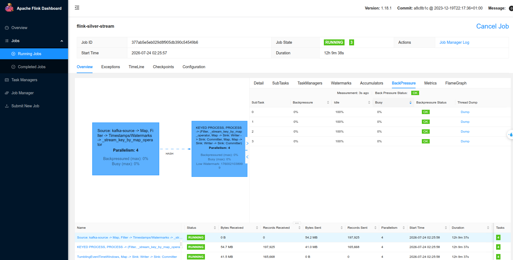
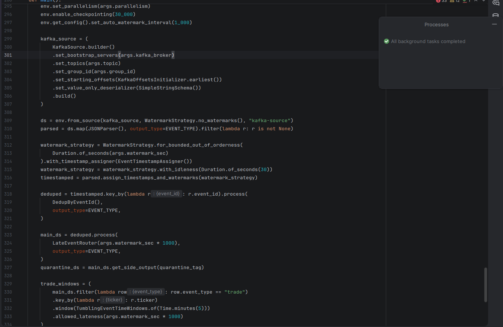

# Processing jobs and optimization

## Spark offline path

The baseline is a direct recursive Parquet read followed by a regular join,
deduplication and Delta overwrite. On the generated distribution this exposes
four problems: 80% of volume belongs to VN30, the ticker/date key has 72,000
values, v1 and v2 have different physical schemas, and 1,440 rows repeat an
existing business key.

The implemented path is:

1. `jobs/bronze/offline.py` reads Hive-style partitions recursively with schema
   merge and reconstructs `trade_date`/`schema_version` from paths.
2. Each version is checked against its JSON contract before Bronze is written.
   Populated unknown columns fail the task; all-null columns introduced by
   merged v1/v2 Parquet schemas are accepted.
3. `jobs/silver/daily.py` unions v1/v2 by name, fills planned v1 fields with
   nulls and applies deterministic `(ticker_id, trade_date)` deduplication.
4. Spark AQE, skew join handling and partition coalescing are enabled in
   `jobs/spark_session.py`. Small ticker/date dimensions use broadcast joins;
   fact tables remain partitioned by `trade_date`.
5. Cardinality checks use a composite ticker/date expression, rather than
   independently counting the two columns.

Relevant Spark settings:

```text
spark.sql.adaptive.enabled=true
spark.sql.adaptive.skewJoin.enabled=true
spark.sql.adaptive.coalescePartitions.enabled=true
spark.sql.autoBroadcastJoinThreshold=50MB
spark.databricks.delta.schema.autoMerge.enabled=false
```

`autoMerge=false` is deliberate: planned schema evolution passes through
versioned contracts instead of silently accepting an unregistered field.

Airflow integration is split into DP1 `bronze_offline_ingest`, DP2
`silver_daily`, and DP2 `gold_dimensions_and_facts`; every DAG contains ingest
and validation tasks.

### Spark evidence boundary

The repository contains the same-workload capture runner described below, but
the submitted image set does **not** contain the two Spark driver UI captures.
Therefore the code and Airflow integration prove implementation, while the
rubric request for a visual baseline-versus-optimized comparison remains
unproven. The Spark Master page at port 8080 would only prove cluster
availability and is not substituted for the missing SQL/Stages evidence.

## How to collect Spark UI evidence

The repository includes a dedicated client-mode Spark driver so baseline and
optimized screenshots use the same input, transformations, row amplification
and 32 shuffle partitions. Only AQE, skew handling, partition coalescing and
automatic broadcast settings change.

First capture the baseline:

```bash
make spark-capture-baseline
```

Wait for `CAPTURE READY: BASELINE`, then open:

- `http://localhost:4040` for the driver Jobs, Stages and SQL tabs.
- `http://localhost:8080` for the cluster/application overview.

The driver remains alive for 600 seconds. Capture the configuration summary
from the command plus:

1. SQL query `02 Dimension join`: `SortMergeJoin` in the baseline plan.
2. SQL query `03 Forced merge join`: non-adaptive merge-join plan.
3. Stages: task duration and shuffle read/write distribution, especially the
   `HOT` partition workload.

Press Ctrl+C when finished. Then start the optimized run:

```bash
make spark-capture-optimized
```

Wait for `CAPTURE READY: OPTIMIZED` and capture the same pages and query IDs:

1. SQL query `02 Dimension join`: `AdaptiveSparkPlan` and
   `BroadcastHashJoin`.
2. SQL query `03 Forced merge join`: the final adaptive plan and any skew
   partition split/coalesced shuffle evidence.
3. The same Stages metrics for task duration and shuffle.

Use incognito windows or hard-refresh between runs so the page cannot display
the stopped baseline application from browser cache. The application names
`vnstock-ui-baseline` and `vnstock-ui-optimized` identify each screenshot.
Do not compare the Master UI alone: port 8080 proves cluster/application
presence but does not contain the driver SQL plans or detailed stage metrics.

Optional evidence sizing can be changed without editing Compose:

```bash
SPARK_CAPTURE_HOLD_SECONDS=900 SPARK_CAPTURE_SCALE=8 \
  make spark-capture-optimized
```

Use the same `SPARK_CAPTURE_SCALE` for both runs. Scale 4 is the default and
uses the existing `data/gold/fact_daily_price` and `dim_ticker` Delta tables;
if either table is absent, run the offline Silver/Gold path before capture.
If the capture commands started Spark solely for this evidence session, stop
the remaining cluster containers afterwards:

```bash
docker compose stop spark-worker spark-master
```

## Flink streaming path

The source sends a baseline 200 events/minute and auction bursts near 5,000
events/minute. Arrival records are sorted by `created_ts`; 12% have event time
5–45 seconds behind arrival and 1.5% replay a prior `event_id`. The Kafka
record timestamp is the payload `event_timestamp`, so Flink receives event time
at the source boundary. Topic `stock_market_events_v3` has four
ticker-keyed partitions and `retention.ms=-1`; infinite retention is required
because the deterministic replay uses historical 2025 event timestamps.

`jobs/flink/silver_stream.py` implements:

- four source/processing subtasks, sized for the burst;
- a 60-second bounded-out-of-orderness watermark;
- keyed state deduplication (`first event_id wins`);
- a typed quarantine side output for records beyond watermark plus grace;
- a five-minute event-time tumbling window for trade volume;
- checkpointed JSONL `FileSink` outputs for Silver, quarantine and features.

The running application was submitted with:

```bash
docker compose exec -T flink-jobmanager flink run -d \
  -py /opt/project/jobs/flink/silver_stream.py \
  --kafka-broker kafka:29092 \
  --topic stock_market_events_v3 \
  --group-id flink-silver-stream-v10-final \
  --output-dir /opt/flink/data/final_v10
```

Airflow's `flink_silver_stream` DAG checks the Flink REST endpoint and fails
unless exactly one application named `flink-silver-stream` is running. The
long-lived application itself is started once from the deployment command
above, rather than nesting Docker control inside an Airflow worker.

For evidence, capture Flink UI's job graph, checkpoint page, backpressure page
and task metrics after Kafka lag reaches zero.

### Flink reference execution

| Counter/state | Verified value |
|---|---:|
| Job ID | `377ab5e5eb029d8f905db390c54549b6` |
| Source records | 197,925 |
| Records after event-id dedup | 195,000 |
| Trade-window input | 165,668 |
| Five-minute feature windows | 17,845 |
| Final watermark | `1760021038999` = 2025-10-09 14:43:58 UTC |

The complete counter reconciliation is in
[`evidence/flink_v10_verification.md`](evidence/flink_v10_verification.md).



*Figure 1 — Flink job `377ab5e5eb029d8f905db390c54549b6`
is RUNNING. Three vertices at parallelism four account for 12 running tasks:
Kafka source/timestamp-watermark assignment, keyed processing and file sinks,
then five-minute tumbling event-time windows. The table shows 197,925 source
records and 165,668 records entering the window vertex.*



*Figure 2 — Later checkpoint snapshot of the same job: 858 triggered and 858
completed, zero failed, zero in progress. Each of the three operators
acknowledged 4/4 subtasks; checkpoint 858 completed in 228 ms with 12.4 MB
state. This later UI snapshot supersedes the earlier 23-checkpoint count in
the initial verification note without changing the job result.*



*Figure 3 — Source-vertex Metrics view with per-subtask `numRecordsOut`,
watermark, Kafka offset and pending-record metric selections. The table below
provides the aggregate 197,925 source records and 165,668 process output. The
watermark chart in this particular capture shows an idle/minimum sentinel,
so the final aggregate watermark is taken from the Overview graph in Figure 1
and reconciled in `flink_v10_verification.md`; this figure alone is not used
to claim the final watermark.*



*Figure 4 — Source backpressure inspection after the finite replay drained:
all four subtasks are OK, 0% backpressured, 100% idle and 0% busy. This proves
the final drained state; it does not measure backpressure during the auction
burst itself.*



*Figure 5 — Implemented PyFlink pipeline around lines 295–333:
parallelism/checkpointing, bounded-out-of-orderness watermark assignment,
`key_by(event_id)` stateful deduplication, late-event routing, and keyed
five-minute `TumblingEventTimeWindows` with allowed lateness.*
