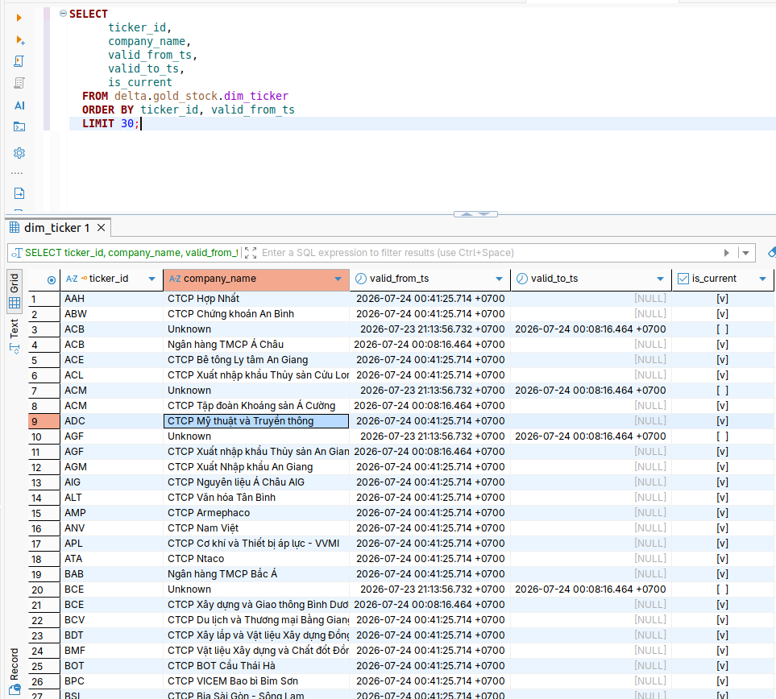
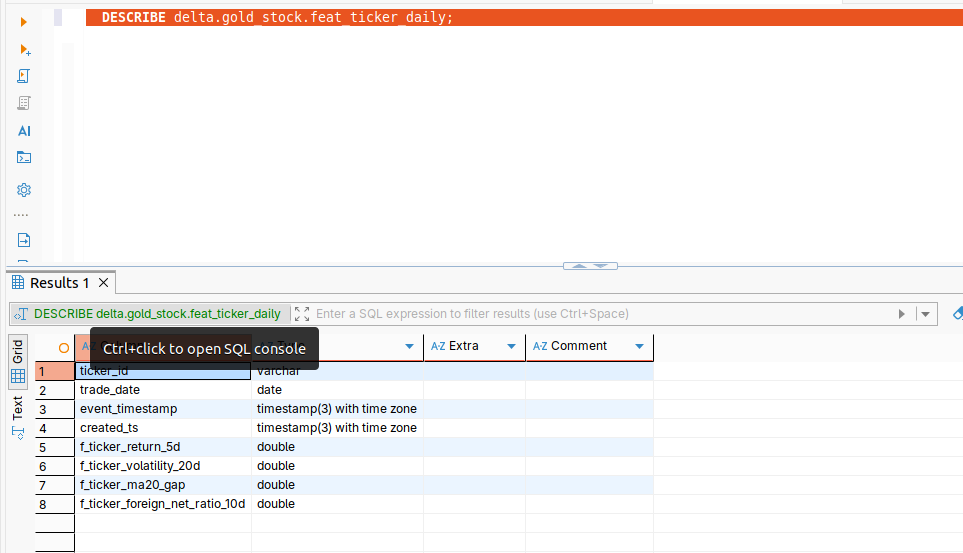
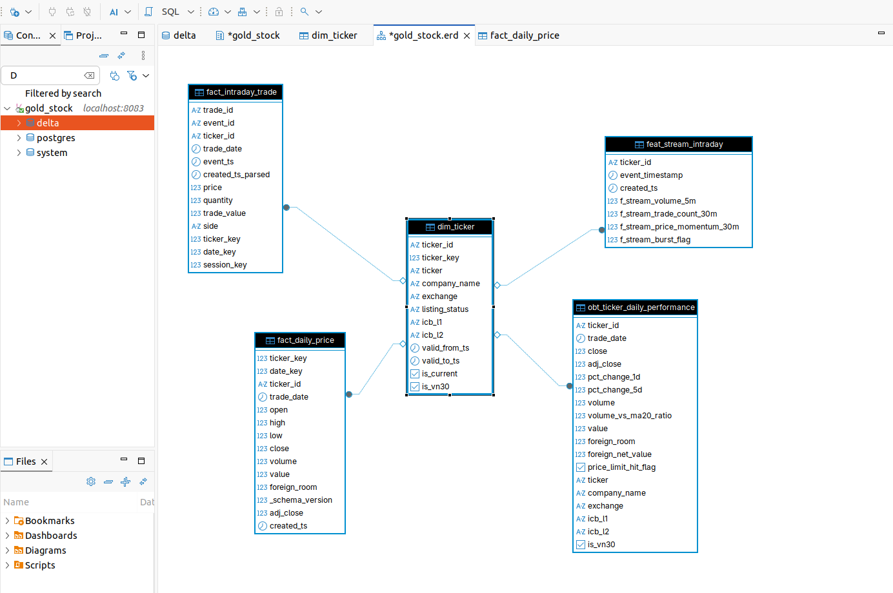

# Schema Design & Pipeline — All Zones

This document adapts Coursework 2.0 to the code that is actually present.
Submitted visual evidence covers a partial Gold ER model, SCD2 rows and
feature timestamps. Spark and DataHub UI captures are explicitly absent;
Flink and Trino evidence is linked from their topic documents.

## 1. Goal

Business-ready Gold model for market analytics/BI, plus end-to-end data pipelines with lineage visibility.

**Approach:** Fact–Dimension + OBT + feature tables for downstream ML, following the Medallion architecture (Bronze → Silver → Gold).

**Storage:** Bronze, Silver and Gold are Delta tables on the shared project
volume. Gold is mirrored to MinIO and registered through Hive Metastore so
Trino can query the `delta.gold_stock` catalog.

**Schema:** `gold_stock` with naming: `dim_`, `fact_`, `obt_`, `feat_`, `agg_` prefixes. Upstream: Bronze uses `raw_`, Silver uses `stg_`.

### Input Data Profile (from 01)

- **Offline:** ~400 tickers × 1 row/day × 2 main tables ≈ 800 rows/trading day (+ quarterly ratios); 180-day backfill ≈ 100K offline rows. Arrives once per day after market close (generator "end-of-day drop" to `landing-vendor-offline/`).
- **Streaming:** ~200 events/min baseline, ~5,000 events/min in ATO/ATC bursts → ~150K–200K events/trading day; intraday trade fact grows to ~25–35M rows over the backfill window. Arrives continuously 09:00–14:45 with two ×25 bursts and a lunch-break silence window (11:30–13:00).
- **Key identifiers:** `ticker_id` + `trade_date` (offline grain); `event_id` with `event_timestamp` (exchange time) vs `created_ts` (arrival time) for streaming.

### Known Data Issues from Generator (01)

| Issue | Offline | Streaming |
|-------|---------|-----------|
| Skew | 80% volume in VN30; 60% value in Banking + Real Estate | — |
| Schema evolution | Partitions before 2025-07-01 missing `foreign_room`, `value` | — |
| Duplicate | 2% on (ticker_id, trade_date) | 1.5% on event_id |
| Burst | — | ×25 at ATO/ATC (200 → 5,000 events/min) |
| Late arrival | — | 12% events delayed 5–45s (clustered in bursts) |
| Calendar gaps | Non-trading days produce zero rows (expected, not an error) | Lunch break 11:30–13:00 (silence window) |
| Drift | Volatility regime shift σ 1.2% → 2.5% after 2025-09-01 | — |

### SLA Targets

These are Coursework 2.0 design targets, not measured SLO results. The Airflow
screenshots prove task completion/order but not weekly availability or
freshness percentiles.

| Pipeline | Freshness Target |
|----------|-----------------|
| Bronze offline ingest | ≤ 10 min from generator drop |
| Bronze stream ingest lag | ≤ 1 min from Kafka arrival |
| Silver daily | ≤ 30 min after Bronze |
| Silver stream | ≤ 5 min |
| Gold fact/OBT | ≤ 30 min after close |
| `feat_ticker_daily` | ≤ 60 min after close |
| `feat_stream_intraday` | ≤ 5 min during trading |
| `feat_ticker_unified` | ≤ 15 min during trading, once at EOD |
| Pipeline availability | ≥ 99% scheduled-run success per week |

---

## 2. Naming Convention

| Layer | Prefix | Storage | Purpose |
|-------|--------|---------|---------|
| Bronze | `raw_` | Delta on shared project volume | Contract-checked snapshot plus ingest metadata |
| Silver | `stg_` | Delta on shared project volume | Deduped, type-cast, schema-harmonized |
| Gold | `dim_`, `fact_`, `obt_`, `feat_`, `agg_`, `ml_` | Delta on shared volume; Gold mirror queried through MinIO/Hive/Trino | Business-ready, query-optimized |

All feature tables carry two timestamp columns:
- `event_timestamp` — the feature as-of time (for point-in-time joins)
- `created_ts` — computation time (for dedup, keep latest)

---

## 3. Bronze Zone (`raw_`)

| Table | Grain | Source | Notes |
|-------|-------|--------|-------|
| `raw_ohlcv_daily` | (ticker_id, trade_date) | MinIO landing Parquet | Schema v1 (pre-2025-07-01) and v2 (post), read via `jobs/bronze/offline.py` |
| `raw_foreign_flow` | (ticker_id, trade_date) | MinIO landing Parquet | |
| `raw_corporate_actions` | action_id | vendor_db (JDBC) | Batch DB-extract pattern |
| `raw_financial_ratios` | (ticker_id, report_quarter) | MinIO landing Parquet | |
| `raw_market_events` | event_id | Kafka (streaming) | Append-only, Kafka offset metadata (`source_offset`, `source_partition`, `source_topic`) |

All Bronze tables carry: `_ingested_at`, `_batch_id`, `_schema_version`.

**Bronze ingestion pipeline** (`dags/bronze_offline_ingest.py` → `jobs/bronze/offline.py`):
1. Pulls generator Parquet drops from `data/landing/run_date=*/` (file-drop pattern) and reference tables from `vendor_db` via JDBC (DB-extract pattern)
2. Validates incoming data against the versioned JSON Schema contract matching its `_schema_version` tag **before** writing to Delta — column present in data but absent from any known contract version → run fails with "contract violation"
3. Appends ingest metadata (`_ingested_at`, `_batch_id`, `_source_path`)
4. Writes to Delta on MinIO with `autoMerge.enabled = false`

---

## 4. Silver Zone (`stg_`)

| Table | Grain | Transform | Notes |
|-------|-------|-----------|-------|
| `stg_daily_price` | (ticker_id, trade_date) | Dedup, domain validate, schema harmonize | Missing columns from v1 → typed NULL + `_schema_version` tag |
| `stg_foreign_flow` | (ticker_id, trade_date) | Dedup | |
| `stg_corporate_actions` | action_id | — | |
| `stg_trades` | trade_id | Dedup by event_id (first arrival wins), watermark=60s | |
| `stg_quotes` | event_id | Dedup | |
| `stg_events_quarantine` | event_id | Late-beyond-watermark events | Side-output from Flink watermark |

**Silver daily pipeline** (`dags/silver_daily.py` → `jobs/silver/daily.py`):
1. Reads Bronze Delta v1+v2 with `unionByName(allowMissingColumns=True)` — union then harmonize approach
2. Dedup by `(ticker_id, trade_date)` keeping latest `_ingested_at` via `row_number()` window
3. Domain validation: `_dq_price_positive`, `_dq_high_ge_max` (high ≥ max(open, close)), `_dq_low_le_min` (low ≤ min(open, close)), `_dq_volume_nonneg` — flagged, not dropped

**Silver stream pipeline** (`dags/silver_stream.py` → `jobs/silver/stream.py`):
- Dedup by `event_id`; the PyFlink stateful path emits the first arrival and
  suppresses later replays with the same ID
- Event-time watermark = 60s (covers 5–45s late range)
- Late-beyond-watermark → `stg_events_quarantine` (side output)
- Contract-validated against `contracts/stg_trades.v1.json` / `contracts/stg_quotes.v1.json`

---

## 5. Gold Zone

All Gold tables live in `data/gold/` as Delta Lake tables. Code in `jobs/gold/`.

### 5.1 Dimensions (`dim_`)

| Table | Grain | SCD Strategy | Key Columns | Code |
|-------|-------|-------------|------------|------|
| `dim_ticker` | one per ticker version | **SCD Type 2** | `ticker_key` (SK), `ticker_id` (BK), `valid_from_ts`, `valid_to_ts`, `is_current` | `dimensions.py:build_dim_ticker()` |
| `dim_date` | one per calendar date | Static | `date_key`, `calendar_date`, `is_trading_day`, `holiday_name` | `dimensions.py:build_dim_date()` |
| `dim_industry` | one per ICB node | Static | `industry_key` (SK), `icb_code` (BK), `icb_level`, `icb_name` | `dimensions.py:build_dim_industry()` |
| `dim_exchange` | one per exchange | Static | `exchange_key` (SK), `exchange_code`, `price_limit_pct` | `dimensions.py:build_dim_exchange()` |
| `dim_session` | one per session type | Static | `session_key` (SK), `session_type` (ATO/CONTINUOUS/ATC/PUT_THROUGH) | `dimensions.py:build_dim_session()` |

**Why SCD Type 2 for `dim_ticker`:** tickers genuinely change over time — exchange transfers (UPCOM → HOSE), company renames, delistings. SCD2 is exercised, not decorative.

**Why `dim_date.is_trading_day`:** the biggest departure from standard date dimensions. All window features count **trading days** (not calendar days), joined through this dimension. Calendar gaps on weekends/holidays are expected.



*Figure 1 — Trino/DBeaver query of `delta.gold_stock.dim_ticker`. Tickers such
as ACB and ACM have a closed historical version (`valid_to_ts` populated,
`is_current=false`) and a later open version (`valid_to_ts=NULL`,
`is_current=true`), demonstrating that the SCD2 columns are populated rather
than only declared.*

### 5.2 Facts (`fact_`)

| Table | Grain | Measures | Code |
|-------|-------|----------|------|
| `fact_daily_price` | (ticker_key, trade_date_key) | open, high, low, close, adj_close, volume, value, foreign_room | `facts.py:build_fact_daily_price()` |
| `fact_intraday_trade` | trade_id | price, quantity, trade_value | `facts.py:build_fact_intraday_trade()` |
| `fact_foreign_flow` | (ticker_key, trade_date_key) | foreign_buy/sell_vol, foreign_buy/sell_value, foreign_net_value | |

**`adj_close` computation:** cumulative adjustment factors from future
split/stock-dividend ex-dates. The Coursework 2.0 design calls for
announcement-time (`known_as_of_date`) versioning; the current fact builder
does not use `announced_ts`, so that stricter point-in-time rule remains an
implementation gap.

**Schema evolution handling:** rows from partitions before 2025-07-01 carry `value = NULL` and `foreign_room = NULL` with `_schema_version` marking the source schema — downstream consumers distinguish "missing by design" from "missing by error."

**Domain checks (market-specific):**
- `price > 0`; `high ≥ max(open, close)`; `low ≤ min(open, close)`
- `|daily change| ≤ exchange price limit` (+ small tolerance)
- `volume ≥ 0`
- Cross-consistency: `sum(fact_intraday_trade.quantity)` per ticker per day ≈ `fact_daily_price.volume`
- Calendar: no fact rows on non-trading days; alert on missing trading days

### 5.3 OBT (`obt_`)

| Table | Grain | Purpose | Code |
|-------|-------|---------|------|
| `obt_ticker_daily_performance` | (ticker_key, trade_date_key) | Denormalized BI dashboard — no joins needed | `obt.py:build_obt()` |

Columns: ticker, company_name, exchange, icb_l1, icb_l2, trade_date, close, adj_close, pct_change_1d, pct_change_5d, volume, volume_vs_ma20_ratio, value, foreign_room, price_limit_hit_flag, is_vn30.

### 5.4 Feature Tables (`feat_`)

All feature tables carry `event_timestamp` + `created_ts`. Dedup: keep latest `created_ts` per `(ticker_id, event_timestamp)`.

| Table | Grain | Features | Refresh | Code |
|-------|-------|----------|---------|------|
| `feat_ticker_daily` | (ticker_id, trade_date) | return_5d, volatility_20d, ma20_gap, foreign_net_ratio_10d | Daily after close | `features.py:build_feat_ticker_daily()` |
| `feat_stream_intraday` | (ticker_id, event_timestamp) | volume_5m, trade_count_30m | 1–5 min during trading | `features/stream.py` |
| `feat_ticker_unified` | (ticker_id, event_timestamp) | Join of daily + intraday features (daily aggregates) | 15 min / EOD | `features.py:build_feat_ticker_unified()` |

**Offline features** (computed via Spark window functions over `fact_daily_price` in `jobs/gold/features.py`):
- `f_ticker_return_5d` — 5-trading-day price return: `(close - lag(close, 5)) / lag(close, 5)`
- `f_ticker_volatility_20d` — stddev of daily returns over 20 trading days (rowsBetween -19 to 0)
- `f_ticker_ma20_gap` — (close − MA20) / MA20, where MA20 = avg(close) over 20-day window
- `f_ticker_foreign_net_ratio_10d` — net foreign buy value / total traded value, 10-day window (joined from `fact_foreign_flow`)

All windows are computed in **trading time**, not wall-clock time — the 20-day volatility window spans 20 *trading* days, skipping weekends/holidays.

**Stream features** (computed via windowed aggregations in `jobs/features/stream.py`):
- `f_stream_volume_5m` — sum(quantity) in tumbling 5-min event-time window, keyed by ticker_id
- `f_stream_trade_count_30m` — count() in sliding 30-min/1-min event-time window, keyed by ticker_id



*Figure 2 — `DESCRIBE delta.gold_stock.feat_ticker_daily` showing both
`event_timestamp` and `created_ts` as timestamp-with-time-zone fields. The
former is the feature as-of time; the latter is computation/materialization
time.*

### 5.5 Point-in-Time Correctness

Two rules, one domain-specific:

1. **Standard rule:** never join feature rows with `event_timestamp` later than the label/reference timestamp.
2. **Adjusted-price rule (stock-specific leakage trap):** corporate-action adjustment factors are applied **retroactively** in most market data sources. A feature computed at time T must use only adjustment factors with `known_as_of_date ≤ T`. Using today's cumulative factor to recompute historical features silently leaks future information about splits/dividends into training data.

### 5.6 Feature TTL Design

This is a Coursework 2.0 design extension. No online feature store or TTL
enforcement service is implemented in this Kỳ 1 repository.

| Feature table | Online TTL | Rationale |
|---|---|---|
| `feat_ticker_daily` | 26 hours | Refreshed once after close; must still be valid for next morning's pre-open scoring run before the new value lands |
| `feat_stream_intraday` | 10 minutes | Refreshed every 1–5 min; a value older than 10 min likely reflects a stalled job, not real market state |
| `feat_ticker_unified` | 20 minutes | Rebuilt every 15 min; 20 min tolerates one missed refresh cycle |

**Proposed session-aware TTL:** outside trading hours (11:30–13:00 lunch,
14:45–09:00 overnight) no new streaming features are produced. A future
online store should suspend freshness aging across closed sessions.

### 5.7 Label Table (`ml_`)

| Table | Grain | Key Columns | Code |
|-------|-------|------------|------|
| `ml_ticker_label` | (ticker_id, event_timestamp) | event_timestamp (feature snapshot T), created_ts (T+3 close), label (0/1) | `labels.py:build_ml_ticker_label()` |

**Label definition:** `price_up_next_3d` = 1 if `adj_close(T+3 trading days) > adj_close(T) × 1.01`, else 0. The +1% / 3-trading-day threshold avoids the pure-noise ~50/50 split of a next-day label and yields a moderately imbalanced target (~35–40% positive).

**Point-in-time discipline:**
- `event_timestamp` = end-of-day T (feature snapshot time)
- `created_ts` = time the label became computable (after close of T+3) — the gap is **structural** (labels arrive 3 trading days late by definition)
- Labels use the implemented `adj_close`; because action factors are not
  announcement-versioned yet, the stricter T+3 corporate-action knowledge
  rule is not fully enforced

### 5.8 Training Table

| Table | Grain | Key Columns | Code |
|-------|-------|------------|------|
| `ml_ticker_training` | (ticker_id, event_timestamp) | Point-in-time join of `ml_ticker_label` + `feat_ticker_daily` on (ticker_id, trade_date) | `drift.py:build_ml_ticker_training()` |

### 5.9 Monitoring Tables (`agg_`)

| Table | Grain | Purpose | Code |
|-------|-------|---------|------|
| `agg_feature_health_daily` | (monitoring_date, feature_name) | Daily mean + PSI vs baseline; alert when PSI > 0.15 | `drift.py:build_agg_feature_health()` |
| `feature_drift_alerts` | alert_date | Alert log with PSI value + recommended action | `drift.py:build_agg_feature_health()` |

PSI (Population Stability Index) computed via `drift.py:compute_psi()`: 10-bin histogram comparison of current distribution vs 30-day baseline window. Alert threshold: **PSI > 0.15**.

Drift alerting is implemented. TTL expiry would be an independent signal in
the proposed online-store extension.

---

## 6. Dimension–Fact Relationships

```
dim_date ─────────────┬── fact_daily_price ──┬── obt_ticker_daily_performance
dim_ticker (SCD2) ────┤                      │
dim_exchange ─────────┤                      │
dim_industry ─────────┘                      │
                      ├── fact_foreign_flow ──┤
                      ├── fact_intraday_trade─┤
dim_session ──────────┘                      │
                                             │
feat_ticker_daily ─────┬── feat_ticker_unified ── ml_ticker_training
feat_stream_intraday ──┘       │
                               └── ml_ticker_label
```



*Figure 3 — DBeaver ER view from the Trino `delta.gold_stock` catalog. The
captured subset shows `dim_ticker` related to `fact_daily_price`,
`fact_intraday_trade`, `obt_ticker_daily_performance` and
`feat_stream_intraday`. Trino/Delta does not expose physical foreign keys, so
these are reviewer-oriented virtual relationships. This image is **partial**:
it does not display Bronze/Silver tables, `dim_date`, foreign-flow facts or the
ML tables; those objects are documented in the model above but are not claimed
as visually proven by this screenshot.*

---

## 7. Pipeline Design

### 7.1 Batch Path (daily, after market close 15:00)

| DAG | Schedule | Input → Output | Code |
|-----|----------|----------------|------|
| `bronze_offline_ingest` | Daily 15:30 | MinIO Parquet + vendor_db → Bronze Delta (contract-validated) | `dags/bronze_offline_ingest.py` |
| `silver_daily` | Daily 16:00 | Bronze Delta → Silver Delta (dedup + validated) | `dags/silver_daily.py` |
| `gold_dimensions_and_facts` | Daily 16:30 | Silver → Gold dims + facts + OBT | `dags/gold_dimensions_and_facts.py` |
| `feat_daily_job` | Daily 17:00 | Gold facts → features + labels + drift | `dags/feat_daily_job.py` |

### 7.2 Streaming Path (continuous, during trading hours 09:00-14:45)

| DAG | Trigger | Input → Output | Code |
|-----|---------|----------------|------|
| `bronze_stream_ingest` | @once | Kafka `stock_market_events_v3` → `raw_market_events` Delta | `dags/bronze_stream_ingest.py` |
| `silver_stream` | @once | `raw_market_events` → `stg_trades` + `stg_quotes` (watermark=60s) | `dags/silver_stream.py` |
| `feat_stream_job` | @once | `stg_trades` → `feat_stream_intraday` | `dags/feat_stream_job.py` |

### 7.3 Maintenance

| DAG | Schedule | Action | Code |
|-----|----------|--------|------|
| `delta_maintenance` | Weekly Sun 03:00 | OPTIMIZE compaction + Z-order on Gold tables | `dags/delta_maintenance.py` → `jobs/gold/maintenance.py` |

### 7.4 Pipeline Update Strategy

- **Offline Bronze/Silver/Gold:** the reference implementation rebuilds
  deterministic snapshots with Delta `overwrite`. This makes a seed-42 rerun
  idempotent but is not an incremental MERGE design.
- **Streaming:** Bronze/Silver/feature paths append with persistent Delta/Flink
  checkpoints; finite `availableNow` mode exists for a reviewable replay.
- **Run metadata:** `ops_pipeline_run` is append-only.
- **Late arrivals:** the PyFlink path assigns event time, applies a 60-second
  out-of-orderness watermark and routes records beyond watermark plus grace to
  a side output. No automated quarantine-reprocessing DAG is implemented.

### 7.5 Pipeline Controls

- **Implemented quality gates:** contract, row/key/domain, uniqueness,
  duplicate/cardinality, referential, SCD2, feature timestamp/contract,
  label-leakage and drift-alert checks.
- **Dependency control:** downstream tasks do not run when an upstream
  `PythonOperator` fails.
- **Recovery:** DAGs configure two or three retries with fixed five- or
  ten-minute delays. Exponential backoff, freshness paging and the proposed
  ±40% rolling-volume alert are design extensions, not current code.

---

## 8. Spark Compute-Layer Optimization

The following settings and transformations are implemented. The repository
also contains `scripts/spark_ui_capture.py` for an identical
baseline/optimized workload, but no Spark UI screenshots were submitted; the
performance comparison is therefore not claimed as measured evidence.

### 8.1 Skew Handling (VN30 concentration)

**Problem:** 80% of volume in 30/400 tickers → `groupBy(ticker_id)` or `join` sends disproportionate rows to VN30 partitions. Visible in Spark UI as a handful of tasks with 10×+ the shuffle read.

**Fixes applied:**

1. **AQE skew join** — `spark.sql.adaptive.enabled=true`, `spark.sql.adaptive.skewJoin.enabled=true` (Spark 3.x automatically splits oversized partitions at runtime)
2. **Broadcast join** for `dim_ticker` (~400 rows) against fact tables — removes shuffle on dimension side entirely
3. Manual salting is not used in the reference implementation.

Enabled in `jobs/spark_session.py:get_spark()`.

### 8.2 High Cardinality

**Problem:** `countDistinct(trade_id)` over millions of rows triggers full shuffle-and-sort.

**Fix:** the Silver `validate_cardinality` task computes both
`approx_count_distinct` and exact counts for ticker and the composite
ticker/date key. This makes the approximation visible and checks it against
the exact 72,000-key coursework-sized result. The dedup window partitions by
`ticker_id, trade_date`; there is no explicit pre-`repartition` call.

### 8.3 Schema Evolution

**Problem:** Partitions before 2025-07-01 missing `foreign_room` and `value` columns. Using `mergeSchema=true` silently unions schemas, hiding the structural absence from downstream consumers.

**Fix:** the landing reader uses schema merge only to load the physical files,
then separates rows by their path-derived `_schema_version` and validates each
subset against its own JSON contract before writing separate v1/v2 Bronze
tables. Silver combines those tables with
`unionByName(allowMissingColumns=True)` and adds typed null columns when
needed. Shared Spark configuration sets
`spark.databricks.delta.schema.autoMerge.enabled=false`.

### 8.4 Duplicate Handling

**Fix:** Dedup by `(ticker_id, trade_date)` keeping latest `_ingested_at` via `row_number()` window in `jobs/silver/daily.py:dedup()`.

---

## 9. Streaming Optimization (Watermark, Burst, Windows)

Evidence is Figures 1–5 in `processing_jobs.md`; these show the final running
job, counters, checkpoints, drained-state backpressure and PyFlink code. There
is no before/after burst backpressure capture.

### 9.1 Late Arrival Handling (12%, 5–45s)

**Problem:** 12% of events have `created_ts` 5–45 seconds later than `event_timestamp`, clustered in burst windows. Processing-time windows assign events to wrong windows.

**Fix — event-time processing with watermark:**
- Watermark strategy: `watermark = event_timestamp - 60s` (covers 5–45s range with margin)
- Allowed lateness: 60s on windowed aggregations — events within bound trigger window recomputation (late firing)
- Events beyond allowed lateness: routed to **side output** (`lateOutputTag`) → `stg_events_quarantine`
- This maps directly to: watermark strategy + allowed lateness + side output = the Flink API surface for "late events within bound merge; later events go to quarantine"

### 9.2 Burst Handling (200 → 5,000 events/min, ×25)

**Problem:** ATO/ATC auction windows produce ×25 baseline volume, causing backpressure on single partition.

**Fixes implemented:**

1. Kafka topic `stock_market_events_v3` has **four** ticker-keyed partitions.
2. Source, keyed process and window vertices each run at parallelism four,
   giving 12 running tasks and letting all partitions consume concurrently.
3. Checkpointed file sinks commit replay output consistently.

The job has no external enrichment call and therefore no `AsyncDataStream`
stage.

### 9.3 Window Processing

| Feature | Window Type | Size | Slide | Key | Code |
|---------|------------|------|-------|-----|------|
| `f_stream_volume_5m` | Tumbling event time | 5 min | — | ticker | `jobs/flink/silver_stream.py` and Spark fallback |
| `f_stream_trade_count_30m` | Sliding event time | 30 min | 1 min | ticker | `jobs/features/stream.py` |

The generator emits no lunch-break events, so windows naturally produce no
rows during that gap. No separate Flink session-gap operator is implemented.

### 9.4 Duplicate Handling (1.5%)

**Fix:** Dedup by `event_id` in a `KeyedProcessFunction`; the implemented
PyFlink path keeps the first arrival and suppresses later replays.

---

## 10. Storage Optimization

> Evidence: Trino EXPLAIN ANALYZE output, Delta OPTIMIZE logs. Code in `jobs/gold/maintenance.py`.

### 10.1 Lakehouse (Delta on MinIO)

**Optimization 1 — Dashboard Query (sector heatmap):**
- **Workload:** `obt_ticker_daily_performance` filtered by date range and icb_l1
- **Bottleneck:** Full scan across dates; small-file problem from daily incremental writes
- **Fix:** Partition by daily `trade_date`, Z-order by `ticker_id`; scheduled `OPTIMIZE` compaction weekly via `delta_maintenance` DAG
- **Result:** no before/after file-count, bytes-scanned or duration screenshot
  was submitted, so no percentage improvement is claimed
- **Trade-off:** Weekly compaction adds maintenance job; temporary 2× storage during rewrite

**Optimization 2 — Intraday Momentum Query (single ticker):**
- **Workload:** `fact_intraday_trade` filtered by single ticker (skewed: VN30 partitions ~10× larger)
- **Bottleneck:** Data skew in file sizes
- **Fix:** Partition by `trade_date`, Z-order by `ticker_id`
- **Trade-off:** Z-order maintenance cost on every compaction

**Implemented in `jobs/gold/maintenance.py:run_maintenance()`:**

Tables optimized with Z-order columns:
- `fact_daily_price` — Z-order `ticker_id`
- `obt_ticker_daily_performance` — Z-order `ticker_id, trade_date`
- `feat_ticker_daily` — Z-order `ticker_id`
- `feat_ticker_unified` — Z-order `ticker_id`
- `ml_ticker_training` — Z-order `ticker_id`
- `dim_ticker` — Z-order `ticker_id`

### 10.2 Relational source storage

PostgreSQL uses the `tickers` primary-key index plus secondary indexes on
corporate-action ticker/date access paths. Figure 1 in
`storage_optimization.md` shows the measured primary-key `Index Scan`. Bloom
filters and a secondary `is_vn30` Delta partition were considered in the
coursework design but are not implemented and are not submission claims.

---

## 11. Data Governance — Lineage & Data Contracts

### 11.1 Lineage

`datahub/lineage.yml` and `datahub/recipe.yml` publish dataset-to-dataset
lineage through DataHub's lineage-file source. The recipe does not publish
Airflow jobs, OpenLineage events, schema contracts or validation assertions.
No DataHub UI screenshot is in the submitted evidence set.

**DP1: Bronze Ingestion**

```
[landing-vendor-offline/] ──┐
                             ├──► [bronze_offline_ingest] ──► raw_ohlcv_daily
[vendor_db (PostgreSQL)] ────┘                                raw_foreign_flow
                                                              raw_corporate_actions
                                                              raw_financial_ratios

[Kafka: stock_market_events_v3] ──► [bronze_stream_ingest] ──► raw_market_events
```

**DP2: Silver + Gold**

```
raw_ohlcv_daily ──► [silver_daily] ──► stg_daily_price ──► [gold_dimensions_and_facts]
                                                               ├─► dim_ticker (SCD2)
                                                               ├─► dim_date
                                                               ├─► fact_daily_price
                                                               ├─► fact_foreign_flow
                                                               └─► obt_ticker_daily_performance
```

**DP3: Feature Tables**

```
fact_daily_price ──► [feat_daily_job] ──► feat_ticker_daily
                                          ml_ticker_label
                                          ml_ticker_training
                                          agg_feature_health_daily

stg_trades ────────► [feat_stream_job] ──► feat_stream_intraday

feat_ticker_daily ─┬──► [feat_daily_job] ──► feat_ticker_unified
feat_stream_intraday┘
```

### 11.2 Data Contracts

Versioned JSON schemas in `contracts/` — each contract specifies required columns, types, nullability, and value-range assertions per `_schema_version`:

| Contract | `_schema_version` | Required Columns |
|----------|-------------------|-----------------|
| `raw_ohlcv_daily.v1.json` | 1 | ticker_id, trade_date, open, high, low, close, volume (7 cols) |
| `raw_ohlcv_daily.v2.json` | 2 | + value, foreign_room (9 cols) |
| `raw_market_events.v1.json` | — | payload_json, source_offset, source_partition, source_topic, _ingested_at |
| `stg_trades.v1.json` | — | event_id, event_ts, ticker, price, quantity, trade_id |
| `stg_quotes.v1.json` | — | event_id, event_ts, ticker, bid_price, ask_price |
| `feat_stream_intraday.v1.json` | — | ticker_id, event_timestamp |

### 11.3 Contract Enforcement

`jobs/bronze/offline.py:validate_contract()` validates incoming Parquet against the contract matching its `_schema_version` **before** writing to Delta.

A column present in the data but absent from any known contract version → **"contract violation"** alert (distinct from known schema evolution, which is a planned v1→v2 change registered in the contracts folder).

`spark.databricks.delta.schema.autoMerge.enabled=false` is set on the shared
Spark session in `jobs/spark_session.py`; every schema change must go through
the explicit contract-versioned write path.

---

## 12. Trino Federated Query (Cross-Source SQL)

Trino acts as a single SQL query interface across **Delta Lake on MinIO** (object storage) and **PostgreSQL** (relational database), enabling cross-source JOINs without ETL data movement.

- Trino catalog files in `docker/trino/catalog/`: `delta.properties` (MinIO-backed Delta), `postgres.properties` (vendor_db)
- Query examples in `scripts/trino_examples.sql` — demonstrates cross-source queries (JOIN Gold Delta tables with PostgreSQL ticker reference), sector performance, OBT dashboard queries, EXPLAIN for partition pruning verification
- Benefit: analysts query Gold data via SQL without needing Spark; Trino optimizes reads at Delta file level (predicate pushdown, partition pruning)
