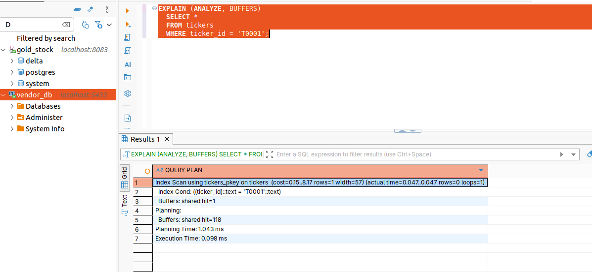

# Storage optimization

## Lakehouse

Bronze, Silver and Gold use Delta Lake. Large daily tables are partitioned by
`trade_date`, which matches the dominant date-range workload without creating
one partition per ticker. `jobs/gold/maintenance.py` and the weekly
`delta_maintenance` DAG run `OPTIMIZE` and Z-order ticker-heavy tables.

- **Workload:** date-range Gold fact/OBT queries with ticker filters.
- **Bottleneck:** repeated incremental writes create small files and force
  unnecessary file scans.
- **Optimization:** partition facts by `trade_date`, compact files, then
  Z-order ticker-heavy tables by `ticker_id`.
- **Result evidence:** implementation exists, but no before/after file-count,
  bytes-scanned or query-duration screenshot is in the submitted image set.
- **Trade-off:** compaction rewrites data and temporarily uses extra I/O and
  storage; date partitioning is intentionally not combined with a
  high-cardinality ticker partition.

The comparison to collect is:

```text
before: number of data files, median file size, query duration
after : number of data files, median file size, query duration
```

Run the same predicate before and after maintenance. Compaction is successful
when file count falls and mean file size increases; elapsed time is supporting
evidence, not the sole criterion because local cache can distort it.

Delta schema auto-merge is disabled. Versioned contracts provide controlled
schema evolution, while Delta transaction logs provide atomic table versions.

## Relational source system

PostgreSQL simulates a vendor/reference database. The initialization SQL
creates primary keys and indexes on access paths used by ingestion:

- ticker primary-key lookups;
- corporate-action ticker and ex-date access;
- referential integrity from actions to tickers.

Generator refreshes use `TRUNCATE ... CASCADE` followed by append, preserving
the pre-created constraints and indexes. They do not replace the table through
`pandas.to_sql`, which would discard database design.

Use `EXPLAIN (ANALYZE, BUFFERS)` before/after an index only on the full-sized
table and include the selected plan in coursework evidence.

### PostgreSQL plan evidence

- **Workload:** point lookup by the vendor business key `ticker_id`.
- **Bottleneck:** a heap scan would inspect unrelated ticker rows.
- **Optimization:** `tickers.ticker_id` is the primary key, which creates the
  `tickers_pkey` B-tree access path. `scripts/init_vendor_db.sql` additionally
  creates secondary indexes on `corporate_actions(ticker_id)` and
  `corporate_actions(ex_date)`.
- **Measured plan:** PostgreSQL selected `Index Scan using tickers_pkey` with
  `Index Cond`, shared-buffer statistics, 1.043 ms planning time and 0.098 ms
  execution time. The chosen literal returned zero rows in this snapshot, but
  the plan still proves index-backed lookup.
- **Trade-off:** indexes improve reads but consume storage and add maintenance
  cost to inserts/updates.



*Figure 1 — DBeaver connected to `vendor_db` on localhost:5433, showing the
SQL and complete `EXPLAIN (ANALYZE, BUFFERS)` result. This proves the
primary-key index path; the two secondary indexes are evidenced by
`scripts/init_vendor_db.sql`, not by this screenshot.*
